<!-- README.md is generated from README.Rmd. Please edit that file -->

# GEGVICshine

<!-- badges: start -->
<!-- badges: end -->

A shiny app created with the intention to provide a user-friendly access
to the `GEGVIC` [package](https://github.com/oriolarques/GEGVIC).
Together they create a workflow to analyse **G**ene **E**xpression,
**G**enetic **V**ariations and **I**mmune cell **C**omposition of tumour
samples using Next Generation Sequencing data.

## Installation

GEGVICshine can be used through VHIO’s server. However, the
computational power of this server is limited. For this reason,
**analyses on the server involving more than 50 samples are
discouraged**. In case more resources are required, we recommend using
GEGVICshine locally.

### Online usage

GEGVICshine can be accessed through the following link:
<https://gegvic.vhio.net/>

### Local usage

To use GEGVICshine locally there are two options.

#### Using Docker (Recommended)

-   Install Docker desktop (<https://www.docker.com/get-started/>)

-   Download the GEGVICshine docker image copying the following command
    in a terminal (<https://hub.docker.com/r/oarques/gegvicshine>).

<!-- -->

    docker pull oarques/gegvicshine

-   In the terminal run

<!-- -->

    docker run -p 80:80 gegvicshine

-   Go to the internet browser (Chrome/Firefox) and type

<!-- -->

    localhost:80

#### Using Rstudio

-   Run the following command in the terminal to get the GEGVICshine
    GitHub repository:

<!-- -->

    git clone https://github.com/oriolarques/GEGVICshine

-   Alternatively, manually download the repository (**app.R** file,
    **R/** folder and **wwww/** folder).

-   In Rstudio, since the `GEGVIC` package requires many dependencies,
    it is recommended to execute the following code before the first
    usage to prepare the environment correctly.

``` r
# CRAN packages 
if(!require(shiny)) install.packages("shiny")
if(!require(dplyr)) install.packages("dplyr")
if(!require(tibble)) install.packages("tibble")
if(!require(tidyr)) install.packages("tidyr")
if(!require(ggplot2)) install.packages("ggplot2")
if(!require(ggrepel)) install.packages("ggrepel")
if(!require(rlang)) install.packages("rlang")
if(!require(ggplotify)) install.packages("ggplotify")
if(!require(ggpubr)) install.packages("ggpubr")
if(!require(patchwork)) install.packages("patchwork")
if(!require(gridExtra)) install.packages("gridExtra")
if(!require(pheatmap)) install.packages("pheatmap")
if(!require(devtools)) install.packages("devtools")
if(!require(remotes)) install.packages("remotes")
if(!require(DT)) install.packages("DT")
if(!require(shinyFiles)) install.packages("shinyFiles")
if(!require(shinythemes)) install.packages("shinythemes")
if(!require(tm)) install.packages("tm")

# Bioconductor packages
if (!requireNamespace("BiocManager", quietly = TRUE)) install.packages("BiocManager")
if(!require(DESeq2)) BiocManager::install("DESeq2")
if(!require(apeglm)) BiocManager::install("apeglm")
if(!require(maftools)) BiocManager::install("maftools")
if(!require(clusterProfiler)) BiocManager::install("clusterProfiler")
if(!require(GSEAmining)) BiocManager::install("GSEAmining")
if(!require(GSEABase)) BiocManager::install("GSEABase")
if(!require(GSVA)) BiocManager::install("GSVA")
if(!require(SummarizedExperiment)) BiocManager::install("SummarizedExperiment")
if(!require(BSgenome)) BiocManager::install("BSgenome")
if(!require(BSgenome.Hsapiens.UCSC.hg19)) BiocManager::install("BSgenome.Hsapiens.UCSC.hg19")
if(!require(BSgenome.Hsapiens.UCSC.hg38)) BiocManager::install("BSgenome.Hsapiens.UCSC.hg38")
if(!require(BSgenome.Mmusculus.UCSC.mm10)) BiocManager::install("BSgenome.Mmusculus.UCSC.mm10")
if(!require(BSgenome.Mmusculus.UCSC.mm39)) BiocManager::install("BSgenome.Mmusculus.UCSC.mm39")
if(!require(DO.db)) BiocManager::install("DO.db")
if(!require(GO.db)) BiocManager::install("GO.db")

# Github packages
remotes::install_github("icbi-lab/immunedeconv")
devtools::install_github('raerose01/deconstructSigs')
devtools::install_github("oriolarques/GEGVIC")
```

-   Then run the `GEGVICshine` app using the following code:

<!-- -->

    shiny::runApp('path to the app.R file')

## User manual

*This section details how to use the `GEGVICshine` app. The same
information can be located in the tab Getting started within the app.*

Within `GEGVICshine`, the user is guided through the different steps
necessary to perform all the analyses. This includes the uploading of
the input files and all the tuning parameters that can be modified to
personalise the outputs. This vignette explores all the options present
in the app and shows how to use them properly.

### 1. Navigation tabs

The interface of the app is quite simple, with a top panel containing
the different tabs that the user can use to set the analysis parameters
and to visualise the results:

-   Parameters
-   GE_module (Gene Expression module)
-   GV_module (Genomic Variations module)
-   IC_module (Immune cell Composition module)
-   Getting started
-   About


### 2. App Sections

#### 2.1. Getting started & About

This tab is where you can find the present manual page. And information
about the project.

#### 2.2. Parameters

Parameters is the default tab that appears when opening the app and is
the section where the user can upload the input files and define the
rest of the parameters needed to perform all the analyses. In total
there are four sub-tabs in this section and the user must fill in the
indicated parameters in each case and click the button to access the
next sub-tab.

In all of the cases, for each parameter has a tag (between brackets)
that indicates in which modules it is necessary. The codes are: **GE**
for the GE_module (Gene Expression), **GV** for the GV_module (Genomic
Variations) or **IC** for the IC_module (Immune cell Composition).

The parameters sub-tabs are:

##### 1. Modules selection & Sample Data

Click to select which of the modules (either one, two or all three) will
be included in the analysis.

There is an additional button to download sample input data. These can
be used to reproduce the results from this manual.

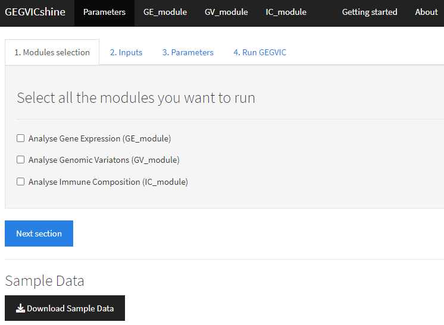

##### 2. Inputs

Here the user need to upload the necessary input files:

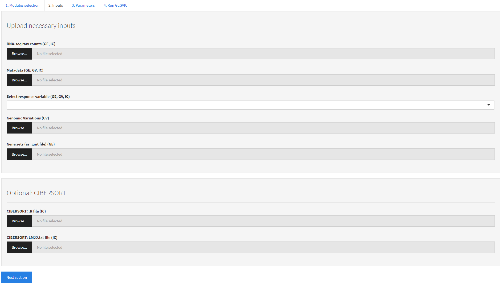

**All files must be .csv files (comma separated values) except for the
gene sets that must be in the form of a .gmt file.** The format of each
specific file should be as follows:

-   **RNA-sequencing raw counts**: Table containing raw gene counts as
    rows and samples as columns. The first column must contain gene
    identifiers that can be either NCBI ID, ENSEMBL gene ID or HGNC ID
    and its column name MUST be adequately named as either:
    **entrezgene_id**, **ensembl_gene_id** or **hgnc_symbol**
    respectively.


-   **Genomic variations**: Table containing short variant calls.
    Necessary columns MUST have the following names (following the MAF
    format: <https://docs.gdc.cancer.gov/Data/File_Formats/MAF>
    \_Format/):

    – Hugo_Symbol: Gene symbol from HGNC.

    – Chromosome: Affected chromosome.

    – Start_Position: Mutation start coordinate.

    – End_Position: Mutation end coordinate.

    – Reference_Allele: The plus strand reference allele at this
    position. Includes the deleted sequence for a deletion or “-” for an
    insertion.

    – Tumor_Seq_Allele2: Tumor sequencing discovery allele.

    – Variant_Classification: Translational effect of variant allele.
    Can be one of the following: Frame_Shift_Del, Frame_Shift_Ins,
    In_Frame_Del, In_Frame_Ins, Missense_Mutation, Nonsense_Mutation,
    Silent, Splice_Site, Translation_Start_Site, Nonstop_Mutation, RNA,
    Targeted_Region.

    – Variant_type: Type of mutation. Can be: ‘SNP’ (Single nucleotide
    polymorphism), ‘DNP’ (Double nucleotide polymorphism), ‘INS’
    (Insertion), ‘DEL’ (Deletion).

    – Tumor_Sample_Barcode: Sample name.


-   **Samples metadata**: Table that contains additional information to
    the samples to create groups such as response to a therapy. The
    first column MUST be named **Samples** and contain the same
    nomenclature for each sample as in the RNA-sequencing raw counts and
    Genomic variations data tables.

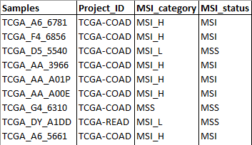

-   **Select the response variable**: Once the metadata file is
    uploaded, the user must select which variable will be used as
    grouping variable in all of the different analyses.

-   **Gene set collections to be analysed by GSEA in a form of a .gmt
    file**: Those files can be downloaded from the Molecular Signatures
    Database, [MSigDB](http://www.gsea-msigdb.org/gsea/downloads.jsp) or
    be customly created following the corresponding \[guidelines\]
    (<https://software.broadinstitute.org/cancer/software/gsea/wiki/index.php/Data_formats>).
    In the case of working with mouse data gmt files can be found
    [here](https://bioinf.wehi.edu.au/MSigDB/).

-   *To use the CIBERSORT algorithm, the user need to register on the
    CIBERSORT web page (<https://cibersort.stanford.edu>), obtain a
    license and download the source code in form of two files
    CIBERSORT.R and LM22.txt. Then both files need to be uploaded in the
    corresponding space.*

##### 3. Parameters:

This section contains several parameters that need to be completed
either as a drop-down list, an empty space to be filled in with text or
with numeric values or as checkboxes. List and numeric parameters
contain one of the options selected by default, whereas in the case of
the text parameters the box contains a character string giving the user
a hint as to what can be entered.


-   **Genes ID (GE, IC)**: Name of the column that contains gene
    identifiers (entrezgene_id, ensembl_gene_id or hgnc_symbol).

-   **Design formula (GE)**: A formula that expresses how the counts for
    each gene depend on the variables in the metadata (for example
    Cell + Treatment + Cell:Treatment)

-   **Reference level (GE)**: Name of the grouping variable in the
    metadata that will be used as the reference to be compared against.

-   **Colors**: Indicate the color for each sample group separated by
    commas (GE, GV, IC).

-   **Shrinkage method (GE)**: Name of the shrinkage method to apply
    within the DESeq2 algorithm. It can be either **apeglm**, **ashr**,
    **normal** or **none**. Default value is *apeglm* and sse *none* to
    skip shrinkage.

-   **BiomaRt database (GE, IC)**: Data frame containing a biomaRt query
    with the following attributes: ensembl_gene_id, hgnc_symbol,
    entrezgene_id, transcript_length,refseq_mrna. Options are
    ensembl_biomartGRCh37 and ensembl_biomartGRCh38_p13 for *Homo
    sapiens* or ensembl_biomartGRCm38_p6 and ensembl_biomartGRCm39 for
    *Mus musculus* samples..

-   **Fold Change (GE)**: An integer to define the fold change value to
    consider that a gene is differentially expressed. Default value is
    2.

-   **Adjusted p-value for gene expression data (GE)**: Numeric value to
    define the maximum adjusted p-value to consider that a gene is
    differentially expressed.

-   **Adjusted p-value for GSEA (GE)**: Numeric value to define the
    adjusted pvalue cutoff in GSEA. Set to 0.2 by default.

-   **Select genesets for GSVA (GE)**: List of options to choose whether
    the gene sets that will be used for GSVA are those from the Hallmark
    [collection](http://www.gsea-msigdb.org/gsea/msigdb/index.jsp) or
    the same that where indicated for GSEA.

-   **GSVA method (GE)**: List of the methods available for GSVA. Either
    *gsva*, *ssgsea* or *zscore*.

-   **Advanced plot options**: Check boxes to decided whether column- or
    row-names or points should be added in specific plots.

-   **Cancer types: TCGA Study Abbreviations (IC)**: List of TCGA study
    abbreviations. For more information visit the following
    [link](https://gdc.cancer.gov/resources-tcga-users/tcga-code-tables/tcga-study-abbreviations).

-   **Select means comparison method (GV, IC)**: Methods used for
    comparing means between groups. Options are **t.test**(parametric)
    and **wilcox.test** (non-parametric) for two groups or **anova**
    (parametric) and **kruskal.test** (non-parametric) for more groups.

-   **Number of genes for oncoplot (GV)**: Numeric value indicating the
    number of genes that will appear in the oncoplot.

-   **Select genomic build (GV)**: Version of the genome to work with.
    Options are BSgenome.Hsapiens.UCSC.hg19 or
    BSgenome.Hsapiens.UCSC.hg38 for *Homo sapiens* and
    BSgenome.Mmusculus.UCSC.mm10 or BSgenome.Mmusculus.UCSC.mm39 for
    *Mus musculus*.

-   **Select mutational signatures matrix (GV)**: Mutation matrices from
    \[COSMIC\]((<https://cancer.sanger.ac.uk/sign> atures/downloads/)
    for single (SBS) and double (DBS) base substitutions. Matrices from
    versions 2 and 3.2 are available for *Homo sapiens* and *Mus
    musculus*.

##### 4. Run GEGVIC

Once all the desired modules have been selected, the input files have
been uploaded and the parameters have been set, it is time to click the
`execute` button to start the analyses. Once the process start, a
progress bar will appear in the lower right corner of the screen showing
the processes that are being executed in the server.

 

##### Note: Vignette reproducibility

*The following list contain specific values to reproduce this vignette
results. Those parameters not mentioned should be left as default.*

    - RNA-seq raw counts, Metadata, Genomic Variations and Gene sets: files from [GEGVIC page](https://github.com/oriolarques/GEGVIC/tree/main/inst/extdata)

    - Select response variables: MSI_status

    - Genes ID: ensembl_gene_id

    - Design formula: MSI_status

    - Reference level: MSS

    - Colors: orange, black

    - BiomaRt database: ensembl_biomart_GRCh38_p13

    - Cancer types: coad

    - Select means comparison method: wilcox.test

    - Genomic build: BSgenome.Hsapiens.UCSC.hg38

    - Select mutational signatures matrix: COSMIC_v2_SBS_GRCh38

#### 2.3. GE_module

This section contains the results of the differential gene expression
analysis, which is calculated using the `DESeq2`
[package](https://bioconductor.org/packages/release/bioc/html/DESeq2.html).
For GSEA, `clusterProfiler`
[package](https://bioconductor.org/packages/release/bioc/html/clusterProfiler.html)
is used for the analysis and `GSEAmining`
[package](https://bioconductor.org/packages/release/bioc/html/GSEAmining.html)
and `GSVA`
[package](https://www.bioconductor.org/packages/release/bioc/html/GSVA.html)
are used for results summary and visualization.

-   **PCA** with all the samples colored as indicated by the user.

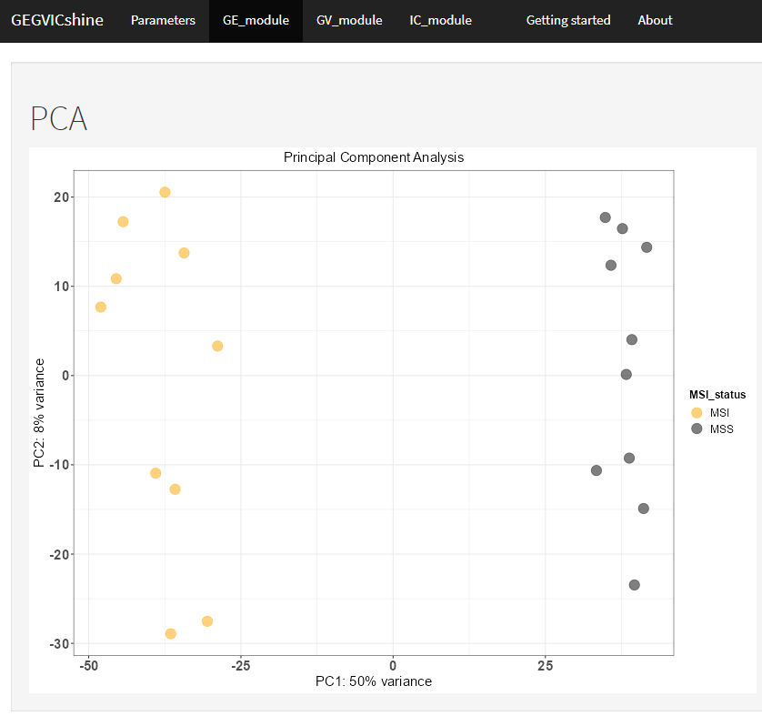

The next section, entitled *Differentially Expressed Genes*, contains
the rest of the analyses in different sub-tabs. There will be one tab
per each group comparison, and their total number will depend on the
total number of sample groups. In each case the following information
will be shown:

-   **Table of differential gene expression**: This table shows
    different values per each gene such as fold change in log2 scale or
    the adjusted p-values. This table is dynamic, meaning that the
    number of rows shown can changed by the user. Also, rows can be
    sorted by clicking the name of a specific column or use the search
    box to filter by gene symbol. The download button can be used to
    obtain the table as a .csv file.

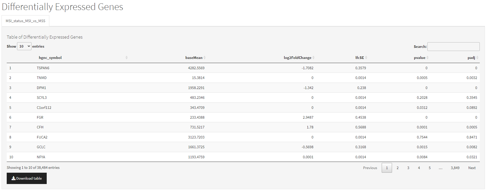

-   **Volcano plot** summarising the results from the table.
    Significantly up- or down-regulated genes, meaning that the fold
    change and adjusted p-values pass the criteria indicated by the user
    in the parameteres section, will be shown in red or blue
    respectively. Additionally, the gene symbol of top 10 genes in each
    direction will be plotted.

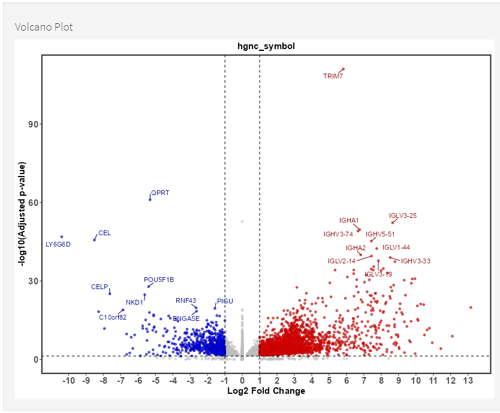

-   **Gene Set Enrichment Analysis (GSEA)**: The results of GSEA will be
    shown in a table similar to that from the diferential gene
    expression. The resulting top 20 regulated gene sets are shown in a
    bubble plot where Normalized Enrichment Score (NES) is shown. The
    size of the bubbles are determined by the percentage of genes in the
    gene set that belong to the leading edge (core). Then, results from
    the `GSEAmining` package will be plotted. The first is a clustering
    of the top 20 more enriched gene sets in the analysis. The second
    plot will be a word cloud for each cluster highlighting the most
    enriched terms within the gene sets present in that cluster.

*Note: In the case there are no gene sets enriched with the p-value
cutoff defined by the user, a message will be shown instead of the table
and figures.*

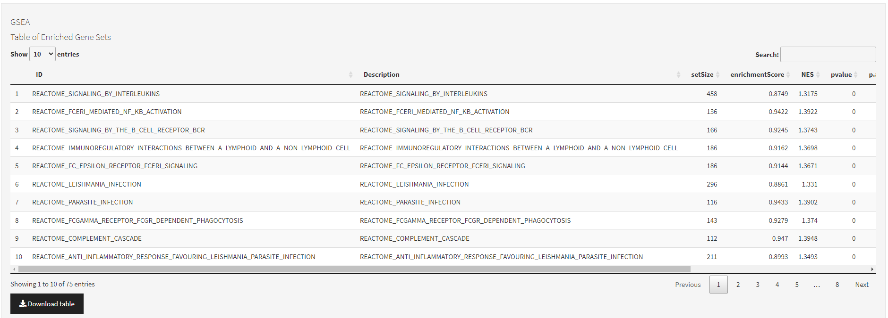 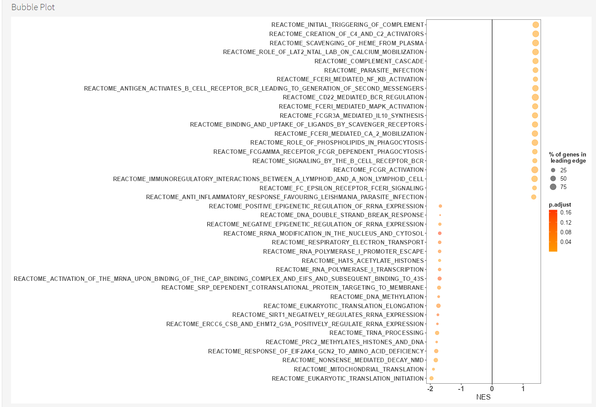
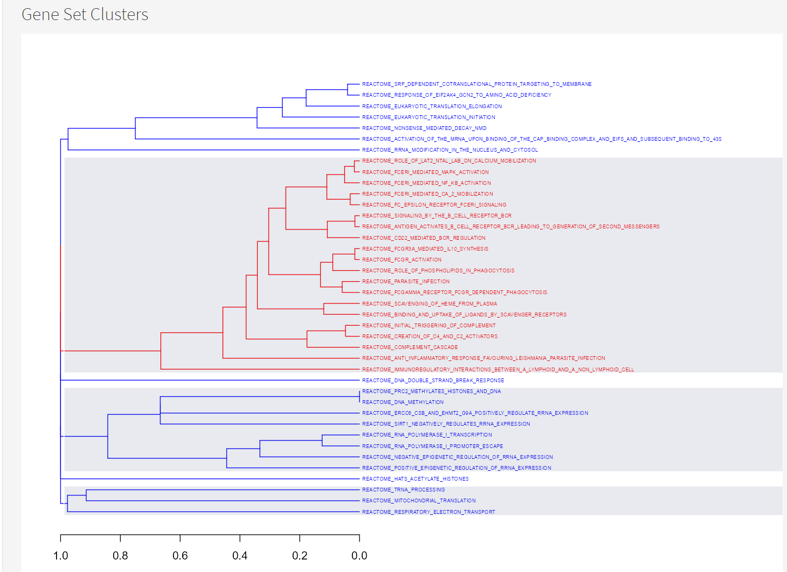 
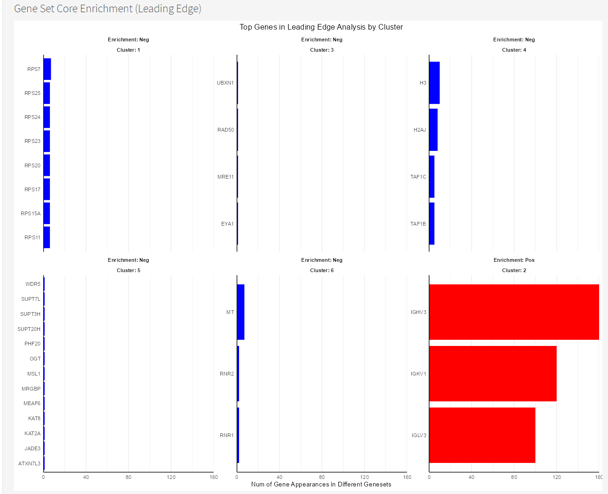

-   **Gene Set Variation Analysis (GSVA)**: Results are shown as a
    heatmap and the values in a table.

 

#### 2.4. GV_module

This section contains the results of the the analysis of genomic
variations in the samples. Mutation summaries are calculated using the
`maftools`
[package](https://bioconductor.org/packages/release/bioc/html/maftools.html),
whereas mutational signatures are predicted using the `deconstructSigs`
[package](https://github.com/raerose01/deconstructSigs).

-   **Mutations summary**: The first figure shows a general summary of
    the mutations, including the type of variations, the proportion of
    base changes or the number of mutations per sample.

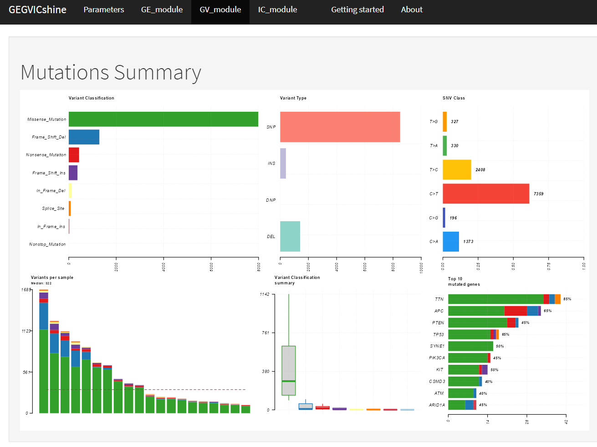

-   **Oncolplot** with the most frequently mutated genes (number defined
    by the user).


-   **Mutational load**: Here, the mutational load, defined as the total
    number of mutations per sample, will be calculated per each sample
    and a comparison by groups will be shown. Values will be available
    in a table.

 

-   **Mutational signatures**: Giving the selected version of the genome
    and the COSMIC matrix, the app will predict the contribution of
    different mutational signatures in each sample. Then, two
    complementary figures will be plotted. The first is a bar plot
    showing the top four mutational signatures per sample (separated by
    groups), whereas the second figure is a heatmap showing the
    contribution of all predicted mutational signatures per sample. The
    values to genereate these plots are shown in the corresponding
    table.

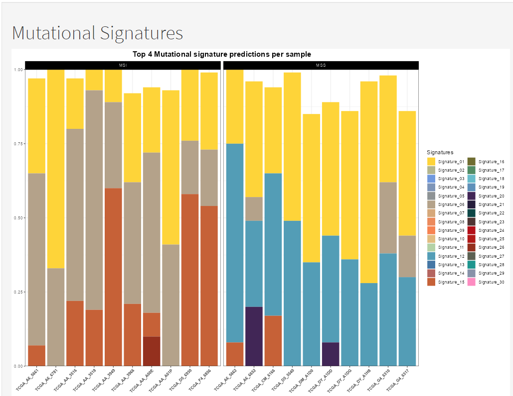
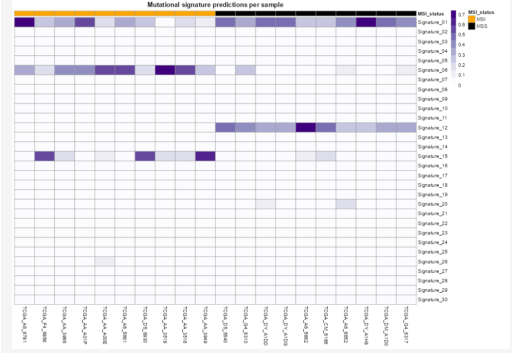


#### 2.5. IC_module

This section contains the predictions of immune cell composition in the
tumour microenvironment from RNA-sequencing data. Predictions are made
using the `inmmunedeconv`
[package](https://github.com/icbi-lab/immunedeconv), which include six
prediction algorithms: QUANTISEQ, TIMER, MCP_COUNTER, XCELL, EPIC and
CIBERSORT.

-   **Summary of predicted immune cell populations**: Table showing the
    prediction results of each immune cell types by each algorithm per
    sample with the same format as the other tables commented before.
    Like them, there is also download button to obtain the full table in
    a form of a .csv file.

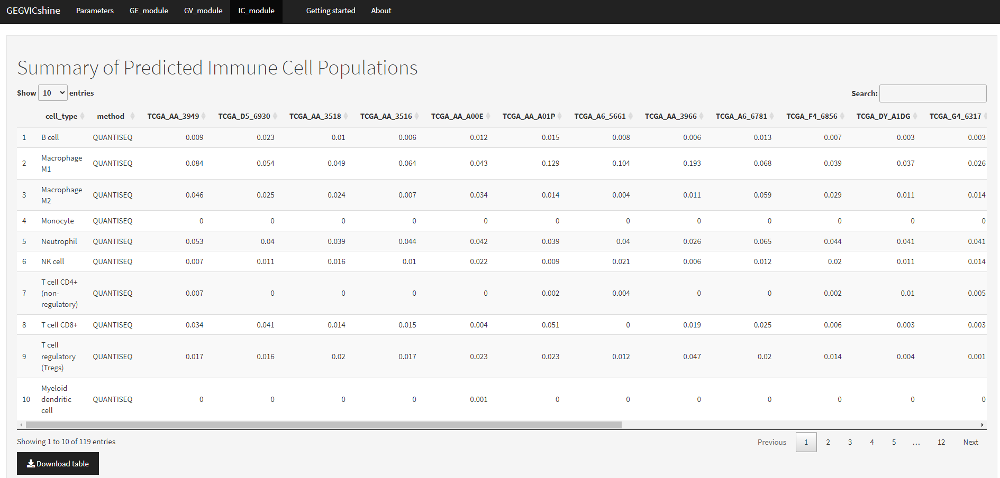

-   **Immune composition cell types comparison by groups**: A plot were
    each immune cell type is compared between sample groups within all
    the six prediction methods. CIBERSORT result will only be shown if
    the user specifies a local folder.

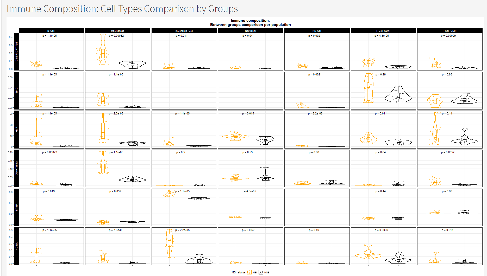

-   **Immune composition: Cell types comparison within samples**: A plot
    were the predicted percentage of each immune cell type is show for
    each sample. Only CIBERSORT, EPIC and QUANTISEQ methods allow to
    compare cell types within a sample. CIBERSORT result will only be
    shown if the user specifies a local folder.

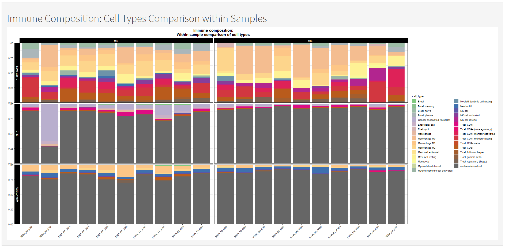

-   **Immune Score**: The state of Effector cells (EC), Suppressor cells
    (SC), Immunomodulators (CP) and MHC molecules (MHC) are shown. All
    this values are added up to calculate an immunophenoscore (IPS). The
    table show the corresponding values for each sample. Finally, there
    is a button to generate a pdf report that will contain an
    immunophenogram (IPG) per each sample per page. Here we show an
    example of one of the samples. For further interpretation please
    visit [The Cancer Immunome Atlas](https://tcia.at/tools/toolsMain).

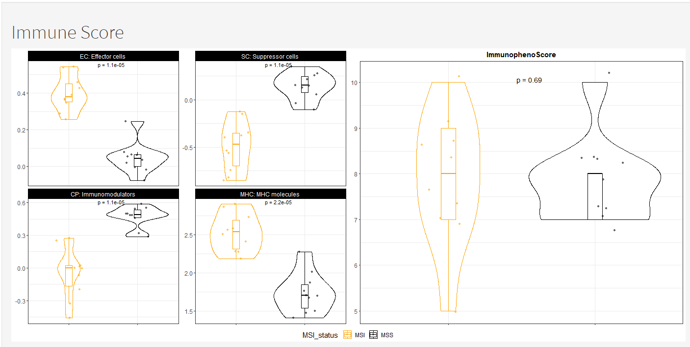

 
