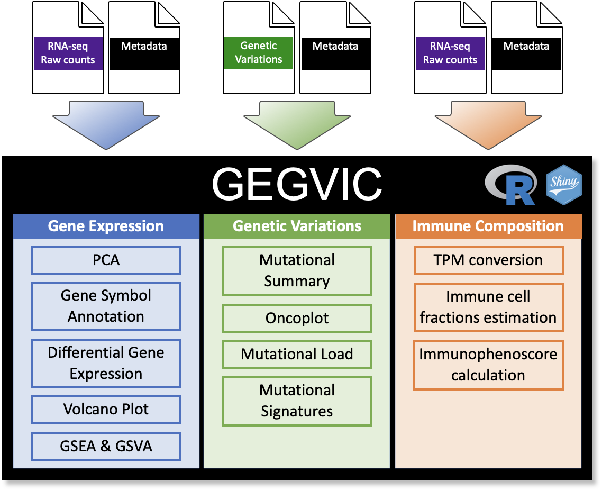
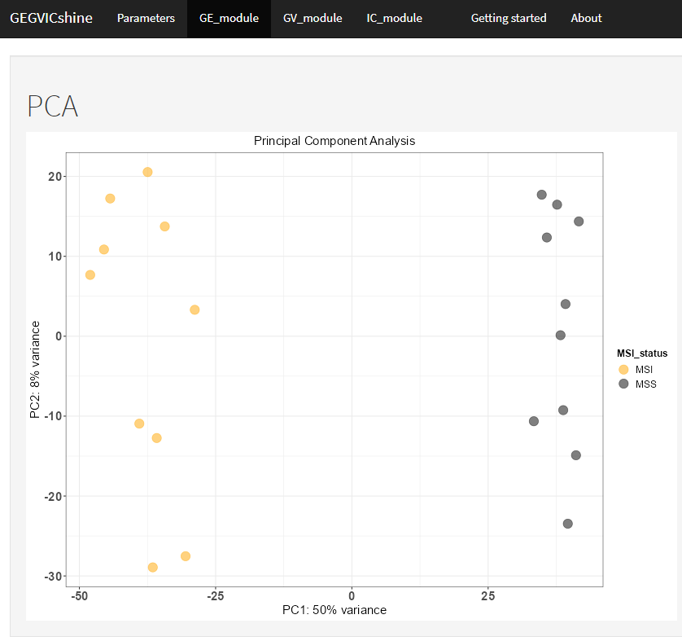
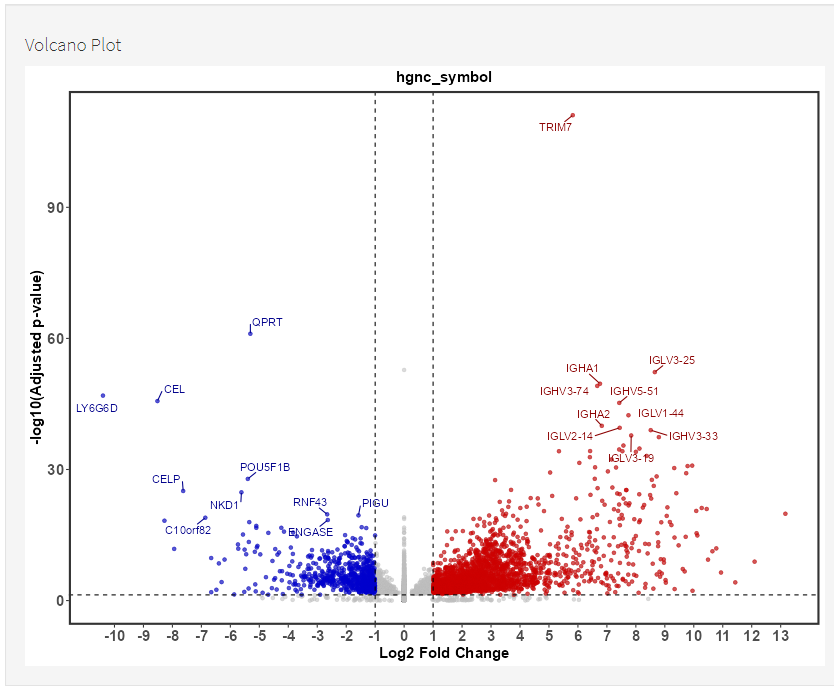

# GEGVICshine
## User Manual

This is a shiny app created with the intention to provide a user-friendly access to the `GEGVIC` [package](https://github.com/oriolarques/GEGVIC). Together they create a workflow to analyse **G**ene **E**xpression, **G**enetic **V**ariations and **I**mmune cell **C**omposition of tumour samples using Next Generation Sequencing data. 

With `GEGVICshine`, the user is guided through the different steps necessary to perform all the analyses. This includes the uploading of the input files and all the tuning parameters that can be modified to personalise the outputs. This vignette explores all the options present in the app and shows how to use them properly. 

### 1. Navigation tabs

The interface of the app is quite simple, with a top panel containing the different tabs that the user can use to set the analysis parameters and to visualise the results:

- Getting started
- Parameters
- GE_module (Gene Expression module)
- GV_module (Genetic Variations module)
- IC_module (Immune cell Composition module)

### 2. App Sections

#### 2.1. Getting started

This tab is where you can find the present manual page.

#### 2.2. Parameters

Parameters is the default tab that appears when opening the app and is the section where the user can upload the input files and define the rest of the parameters needed to perform all the analyses. In total there are four sub-tabs in this section and the user must fill in the indicated parameters in each case and click the button to access the next sub-tab. 

In all of the cases, each parameter has a tag (between brackets) that indicates in which analytical modules it is necessary. The codes are: **GE** for the GE_module (Gene Expression), **GV** for the GV_module (Genetic Variations) or **IC** for the IC_module (Immune cell Composition).

The parameters sub-tabs are:

##### 1. Modules selection

Click to select which of the modules (either one, two or all three) will be included in the analysis.

##### 2. Inputs

Here the user need to upload the necessary input files: 

- **RNA-sequencing raw counts**: Table containing raw gene counts as rows and samples as columns. The first column must contain gene identifiers that can be either NCBI ID, ENSEMBL gene ID or HGNC ID and its column name MUST be adequately named as either: **entrezgene_id**, **ensembl_gene_id** or **hgnc_symbol** respectively.

- **Genetic variations**: Table containing short variant calls. Necessary columns MUST have the following names (following the MAF format: https://docs.gdc.cancer.gov/Data/File_Formats/MAF _Format/):
    – Hugo_Symbol: Gene symbol from HGNC.
    – Chromosome: Affected chromosome.
    – Start_Position: Mutation start coordinate.
    – End_Position: Mutation end coordinate.
    – Reference_Allele: The plus strand reference allele at this position. Includes the deleted sequence for a deletion or “-” for an insertion.
    – Tumor_Seq_Allele2: Tumor sequencing discovery allele.
    – Variant_Classification: Translational effect of variant allele. Can be one of the following:
    Frame_Shift_Del, Frame_Shift_Ins, In_Frame_Del, In_Frame_Ins, Missense_Mutation, Nonsense_Mutation, Silent, Splice_Site, Translation_Start_Site, Nonstop_Mutation, RNA, Targeted_Region.
    – Variant_type: Type of mutation. Can be: ‘SNP’ (Single nucleotide polymorphism), ‘DNP’ (Double nucleotide polymorphism), ‘INS’ (Insertion), ‘DEL’ (Deletion).
    – Tumor_Sample_Barcode: Sample name.

- **Samples metadata**:Table that contains additional information to the samples to create groups such as response to a therapy. The first column MUST be named **Samples** and contain the same nomenclature for each sample as in the RNA-sequencing raw counts and Genetic variations data tables.

- **Gene set collections to be analysed by GSEA in a form of a .gmt file**: Those files can be downloaded from the Molecular Signatures Database, [MSigDB](http://www.gsea-msigdb.org/gsea/downloads.jsp) or be customly created following the corresponding [guidelines] (https://software.broadinstitute.org/cancer/software/gsea/wiki/index.php/Data_formats). In the case of working with mouse data gmt files can be found [here](https://bioinf.wehi.edu.au/MSigDB/). 

- **Select folder in your computer containing: CIBERSORT.R and LM22.txt files (IC)**: As the title indicates, the user need to navigate through the system folders to indicate the folder where CIBERSORT.R and LM22.txt files are stored. 
*To use the CIBERSORT algorithm, the user need to register on the CIBERSORT web page (https://cibersort.st anford.edu), obtain a license and download the source code in form of two files CIBERSORT.R and LM22.txt. Finally, both files should be stored in the same folder.*

All files must be .csv files (comma separated values) except for the gene sets that must be in the form of a .gmt file. Example files can be obtained from the GEGVIC package or using the following [link](https://github.com/oriolarques/GEGVIC/tree/main/inst/extdata).

##### 3. Parameters: 

This section contains several parameters in three different flavours, either as a drop-down list, an empty space to be filled in with text or with numeric values. List and numeric parameters contain one of the options selected by default, whereas in the case of the text parameters the box contains a character string giving the user a hint as to what can be entered.

- **Genes ID (GE, IC)**: Name of the column that contains gene identifiers (entrezgene_id, ensembl_gene_id or hgnc_symbol).

- **Design formula (GE)**: A formula that expresses how the counts for each gene depend on the variables in the metadata (for example Cell + Treatment + Cell:Treatment)

- **Reference level (GE)**: Name of the grouping variable in the metadata.

- **Colors**: Indicate the color for each sample group separated by commas (GE, GV, IC).

- **Shrinkage method (GE)**: Name of the shrinkage method to apply within the DESeq2 algorithm. It can be either **apeglm**, **ashr**, **normal** or **none**. Default value is *apeglm* and sse *none* to skip shrinkage. 

- **BiomaRt database (GE, IC)**: Data frame containing a biomaRt query with the following attributes: ensembl_gene_id, hgnc_symbol, entrezgene_id, transcript_length,refseq_mrna. Options are ensembl_biomartGRCh37 and ensembl_biomartGRCh38_p13 for *Homo sapiens* or ensembl_biomartGRCm38_p6 and ensembl_biomartGRCm39 for *Mus musculus* samples..

- **Fold Change (GE)**: An integer to define the fold change value to consider that a gene is differentially expressed. Default value is 2.

- **Adjusted p-value for gene expression data (GE)**: Numeric value to define the maximum adjusted p-value to consider that a gene is differentially expressed.

- **Adjusted p-value for GSEA (GE)**: Numeric value to define the adjusted pvalue cutoff in GSEA. Set to 0.2 by default.

- **Cancer types: TCGA Study Abbreviations (IC)**: List of TCGA study abbreviations. For more information visit the following [link](https://gdc.cancer.gov/resources-tcga-users/tcga-code-tables/tcga-study-abbreviations).

- **Select means comparison method (GV, IC)**:  Methods used for comparing means between groups. Options are **t.test**(parametric) and **wilcox.test** (non-parametric) for two groups or **anova** (parametric) and **kruskal.test** (non-parametric) for more groups.

- **Number of genes for oncoplot (GV)**: Numeric value indicating the number of genes that will appear in the oncoplot.

- **Select genomic build (GV)**: Version of the genome to work with. Options are BSgenome.Hsapiens.UCSC.hg19 or BSgenome.Hsapiens.UCSC.hg38 for *Homo sapiens* and BSgenome.Mmusculus.UCSC.mm10 or BSgenome.Mmusculus.UCSC.mm39 for *Mus musculus*.

- **Select mutational signatures matrix (GV)**: Mutation matrices from [COSMIC]((https://cancer.sanger.ac.uk/sign atures/downloads/) for single (SBS) and double (DBS) base substitutions. Matrices from versions 2 and 3.2 are available for *Homo sapiens* and *Mus musculus*.

##### 4. Run GEGVIC

Once all the desired modules have been selected, the input files have been uploaded and the parameters have been set, it is time to click the `execute` button to start the analyses. When the process starts, a progress bar will appear in the lower right corner of the screen showing the processes that are being executed in the server.

#### 2.3. GE_module

This section contains the results of the differential gene expression analysis, which is calculated using the `DESeq2` [package](https://bioconductor.org/packages/release/bioc/html/DESeq2.html). For GSEA, `clusterProfiler` [package](https://bioconductor.org/packages/release/bioc/html/clusterProfiler.html) is used for the analysis and `GSEAmining` [package](https://bioconductor.org/packages/release/bioc/html/GSEAmining.html) is used for results summary and visualization.

- **PCA** with all the samples colored as indicated by the user.

The next section, entitled *differentially expressed genes*, contains the rest of the analyses in different sub-tabs. There will be one tab per each group comparison, and their total number will depend on the total number of sample groups. In each case the following information will be shown:

- **Table of differential gene expression**: This table shows different values per each gene such as fold change in log2 scale or the adjusted p-values. This table is dynamic, meaning that the number of rows shown can changed by the user. Also, rows can be sorted by clicking the name of a specific column or use the search box to filter by gene symbol. The download button can be used to obtain the table as a .csv file.

- **Volcano plot** summarising the results from the table. Significantly up- or down-regulated genes, meaning that the fold change and adjusted p-values pass the criteria indicated by the user in the parameteres section, will be shown in red or blue respectively. Additionally, the gene symbol of top 10 genes in each direction will be plotted.

- **Gene Set Enrichment Analysis (GSEA)**: The results of GSEA will be shown in a table similar to that from the diferential gene expression. Then, results from the `GSEAmining` package will be plotted. The first is a clustering of the top 20 more enriched gene sets in the analysis. The second plot will be a word cloud for each cluster highlighting the most enriched terms within the gene sets present in that cluster. 

*Note: In the case there are no gene sets enriched with the p-value cutoff defined by the user, a message will be shown instead of the table and figures.*

#### 2.4. GV_module

This section contains the results of the the analysis of genetic variations in the samples. Mutation summaries are calculated using the `maftools` [package](https://bioconductor.org/packages/release/bioc/html/maftools.html), whereas mutational signatures are predicted using the `deconstructSigs` [package](https://github.com/raerose01/deconstructSigs).

- **Mutations summary**: The first figure shows a general summary of the mutations, including the type of variations, the proportion of base changes or the number of mutations per sample.

- **Oncolplot** with the most frequently mutated genes (number defined by the user). 

- **Mutational load**: Here, the mutational load, defined as the total number of mutations per sample, will be calculated per each sample and a comparison by groups will be shown.

- **Mutational signatures**: Giving the selected version of the genome and the COSMIC matrix, the server will predict the contribution of different mutational signatures in each sample. Then, two complementary figures will be plotted. The first is a bar plot showing the top four mutational signatures per sample (separated by groups), whereas the second figure is a heatmap showing the contribution of all predicted mutational signatures per sample.

#### 2.5. IC_module

This section contains the results of the predictions of immune cell composition of the tumour microenvironment from RNA-sequencing data. Predictions are made using the `inmmunedeconv` [package](https://github.com/icbi-lab/immunedeconv), which include six prediction algorithms: QUANTISEQ, TIMER, MCP_COUNTER, XCELL, EPIC and CIBERSORT. 

- **Summary of predicted immune cell populations**: Table showing the prediction results of each immune cell types by each algorithm per sample with the same format as the other tables commented before. Like them, there is also download button to obtain the full table in a form of a .csv file.

- **Immune composition cell types comparison by groups**: A plot were each immune cell type is compared between sample groups within all the six prediction methods. CIBERSORT result will only be shown if the user specifies a local folder.

- **Immune composition: Cell types comparison within samples**: A plot were the predicted percentage of each immune cell type is show for each sample. Only CIBERSORT, EPIC and QUANTISEQ methods allow to compare cell types within a sample. CIBERSORT result will only be shown if the user specifies a local folder.

- **Immune Score**: The last two plots contain immunophenogram (IPG) and immunophenoscores (IPS) for each sample and each group of study. They give an overall picture of the state of MHC molecules (MHC), Immunomodulators (CP), Effector cells (EC) and Suppressor cells (SC) in each sample, making possible the comparison between samples. For further interpretation please visit [The Cancer Immunome Atlas](https://tcia.at/tools/toolsMain).

